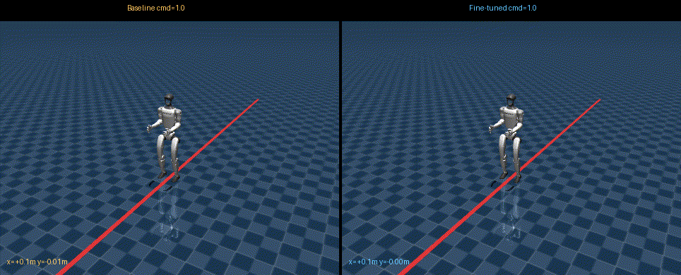
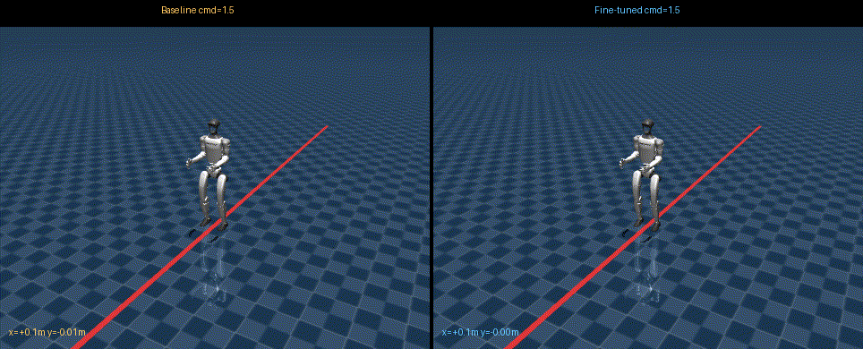
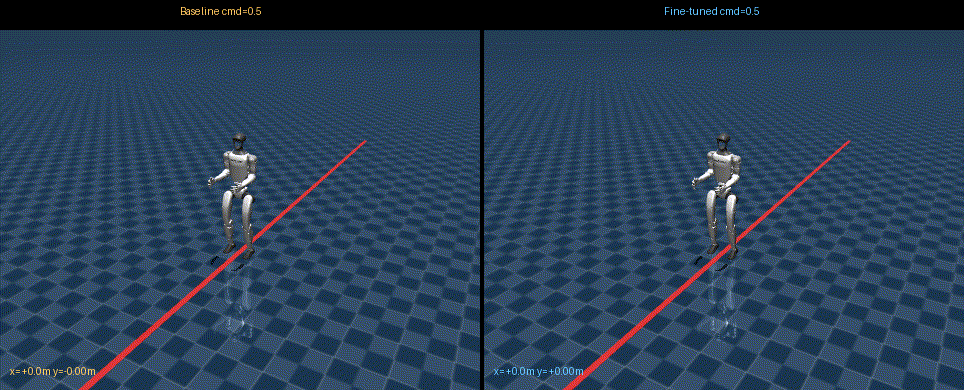
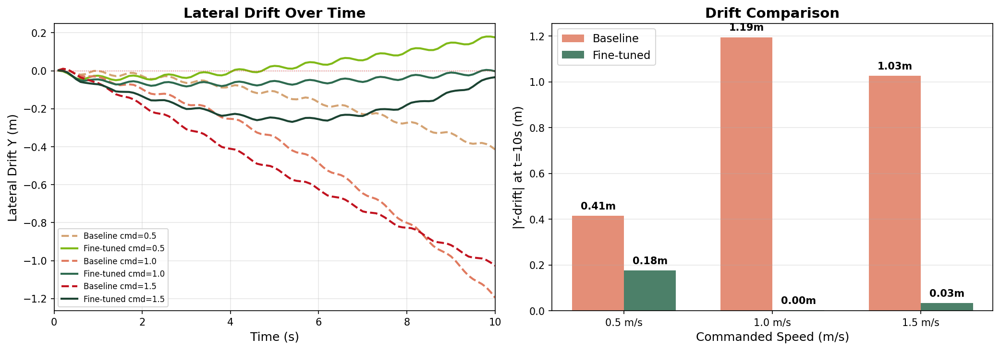

# Unitree G1 Walking Policy Fine-Tuning

Fine-tuning a pre-trained Unitree G1 humanoid LSTM walking policy for **straighter and faster walking** using MJX (JAX + MuJoCo) GPU-accelerated training.

## Results

The fine-tuned policy walks faster than the Unitree baseline at all three commanded speeds and drifts less to the side. The largest drift reduction is at 1.0 m/s, the command used during training.

All numbers below were measured with the heading controller in `deploy_mujoco.py` switched off, so the policy received a yaw-rate command of zero. With the controller on (the default), both policies stay within about 0.15 m of the straight line and the drift difference mostly disappears. To reproduce the tables, set `corrected_yaw_rate = 0.0` in `deploy/deploy_mujoco/deploy_mujoco.py`.

### cmd = 1.0 m/s

| | Baseline | Fine-tuned |
|---|---|---|
| Distance (10s) | 8.67 m | **9.22 m** |
| Y-drift | -1.19 m | **-0.00 m** |



### cmd = 1.5 m/s

| | Baseline | Fine-tuned |
|---|---|---|
| Distance (10s) | 12.13 m | **12.65 m** |
| Y-drift | -1.03 m | **-0.03 m** |



### cmd = 0.5 m/s

| | Baseline | Fine-tuned |
|---|---|---|
| Distance (10s) | 4.58 m | **4.73 m** |
| Y-drift | -0.41 m | **+0.18 m** |



*Left: Unitree baseline. Right: Fine-tuned. Red line = straight path (y=0). Camera tracks forward motion but stays centered on y=0 so lateral drift is visible.*

### Quantitative Comparison



*Left: Y-drift over time (dashed = baseline, solid = fine-tuned). Right: absolute drift at t=10s by commanded speed. The fine-tuned policy drifts less than the baseline at every speed.*

## What the Fine-Tuning Does

The Unitree pre-trained G1 LSTM policy walks well but drifts to its right (toward negative y), ending about 1.2 m off the straight line after 10 s at 1.0 m/s. Our fine-tuning reduces this drift while preserving the natural walking gait, using:

1. **Body-frame velocity tracking** - reward computed in the robot's local frame (not world frame), so the policy correctly tracks commanded velocity even when yawed
2. **Hip position penalty** - penalizes asymmetric hip roll/yaw that causes lateral drift (Unitree's official G1 reward term)
3. **Yaw angle penalty** - directly penalizes heading deviation from the target direction
4. **Behavioral cloning regularization** - PPO loss includes `||action_mean - baseline_action_mean||^2` against a frozen copy of the pre-trained weights, preventing catastrophic forgetting of the walking gait

## Setup

```bash
# Clone the repo
git clone https://github.com/prakash-aryan/Unitree-G1-Walking-Policy-Fine-Tuning.git
cd Unitree-G1-Walking-Policy-Fine-Tuning

# Install dependencies (requires Python 3.10-3.12, uv, NVIDIA GPU)
uv sync

# Convert pre-trained weights to JAX format
LD_LIBRARY_PATH="" PYTHONPATH=. uv run python train_mjx/convert_weights.py

# Train (takes ~10 minutes on RTX 5070 Ti)
LD_LIBRARY_PATH="" PYTHONPATH=. uv run python train_mjx/train.py --num_envs=512 --max_iters=300

# Export back to TorchScript
LD_LIBRARY_PATH="" PYTHONPATH=. uv run python train_mjx/export_to_torch.py \
    --weights train_mjx/checkpoints/best_weights.npz \
    --output deploy/pre_train/g1/motion_finetuned.pt

# Run in MuJoCo viewer
DISPLAY=:1 LD_LIBRARY_PATH="" PYTHONPATH=. uv run python deploy/deploy_mujoco/deploy_mujoco.py g1_terrain.yaml
```

Note: `LD_LIBRARY_PATH=""` is needed if you have Isaac Sim installed, as its CUDA 12.6 libraries conflict with JAX's bundled CUDA 12.9.

## Project Structure

```
train_mjx/
  config.py              # Training hyperparameters and reward weights
  convert_weights.py     # PyTorch TorchScript -> JAX weight conversion
  env.py                 # MJX environment (obs, rewards, termination)
  policy.py              # Flax LSTM actor-critic (matches pre-trained architecture)
  ppo.py                 # PPO with BC regularization and cosine LR decay
  train.py               # Training loop with multi-seed validation
  export_to_torch.py     # JAX weights -> TorchScript conversion

deploy/
  deploy_mujoco/
    deploy_mujoco.py     # MuJoCo viewer deployment with heading P-controller
    configs/
      g1_terrain.yaml    # Deployment config (policy path, scene, command)
  pre_train/g1/
    motion.pt            # Unitree baseline policy (untouched)
    motion_finetuned.pt  # Our fine-tuned policy

resources/robots/g1_description/
  g1_12dof.xml           # G1 robot model (12 DOF legs)
  scene_slab.xml         # Flat ground scene

recordings/
  compare_flat_slow.gif    # Side-by-side at cmd=0.5
  compare_flat_fast.gif    # Side-by-side at cmd=1.0
  compare_flat_sprint.gif  # Side-by-side at cmd=1.5
  comparison_charts.png    # Drift-over-time and drift-by-speed charts
```

## Training Details

- **Base model**: Unitree pre-trained LSTM(64) -> Dense(32, ELU) -> Dense(12)
- **Training**: PPO fine-tuning on flat ground, 512 parallel envs in MJX, ~300 iterations (~10 min on RTX 5070 Ti)
- **Key insight**: Training on the simplest scene (flat slab) produces the most robust generalist policy. Scene-specific training (ramps, rough terrain) produces fragile specialists that regress in deployment.

## Acknowledgments

Built on top of:
- [unitree_rl_gym](https://github.com/unitreerobotics/unitree_rl_gym) - Unitree's RL training framework
- [MuJoCo](https://github.com/google-deepmind/mujoco) / [MJX](https://mujoco.readthedocs.io/en/stable/mjx.html) - GPU-accelerated physics
- [MuJoCo Playground](https://github.com/google-deepmind/mujoco_playground) - reward function design reference
- [PreCi (arXiv 2504.09833)](https://arxiv.org/abs/2504.09833) - behavioral cloning regularization for locomotion fine-tuning

## License

BSD 3-Clause License. See [LICENSE](./LICENSE).
